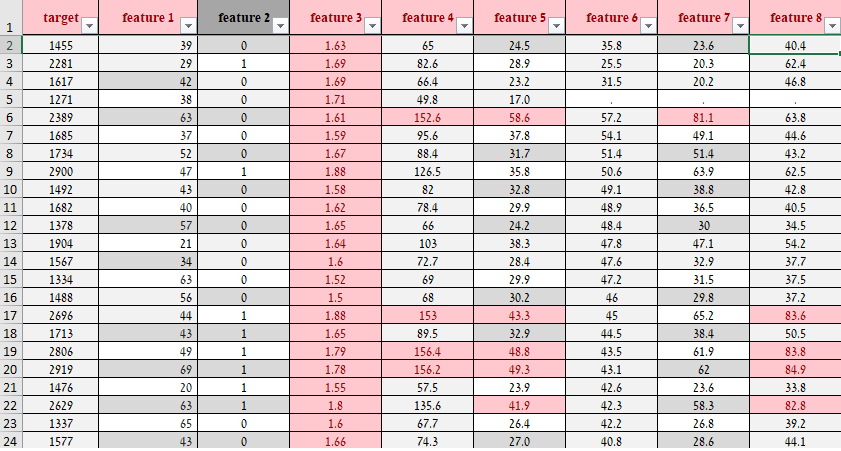
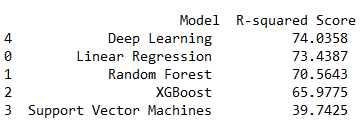

# MetabolicRate
Predictor Algorithm baseed on multi platform machine learning methods to predict tabular data

Includes:
1. DataSet preprocess
2. Classic Machine Learning algorithms results
3. Deep Learning Model results


<table>
  <tr><td>

    Data Set Review
    </td><td>

    Results Comparison
    </td> </tr></table>

## Training and comparing ##
The api made simple as possible.
Also added Optuna wrapper - Use the relevant switches in order to ask Optuna to find the best parameters for your model


## Running the algorithm ##
1. Download repo
```
git clone https://github.com/tomerkeren42/MetabolicRate.git
```
2. Install requriements:
```
pip install -r requirements.txt
```
3. Add Tabular DataSet
```
Path: MetablicRate/dataset/
```
4. Run python main.py -h and follow instructions for your own use
```
  -h, --help            
                        show this help message and exit
  -o, --optuna          
                        Run Optuna optimization for detecting best DL model parameters
  -t TRIALS, --trials TRIALS
                        Number of epoch for Deep Learning Model
  -p PATH, --path PATH  
                        Enter path to dataset
  -log LOG, --log LOG  
                        Write output to new log file at logs/ directory
  -e EPOCHS, --epochs EPOCHS
                        Number of epoch for Deep Learning Model
  -lr LEARNING_RATE, --learning-rate LEARNING_RATE
                        Step size for the optimizer which trains the DL model
  -hu HIDDEN_UNITS, --hidden-units HIDDEN_UNITS
                        Number of hidden units in the hidden layer of the DL model
  -opt {Adam,RMSprop,SGD}, --optimizer-name {Adam,RMSprop,SGD}
                        Optimizer for training the DL model
  -d DROPOUT, --dropout DROPOUT
                        Probability of dropout layer for turning off neurons in the DL model

```
5.Enjoy!
