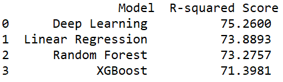

# MetabolicRate
<h3 align='center'>
Predictor Algorithm baseed on multi platform machine learning methods to predict tabular data
  </h4>
  <p align="center">
    <a href="https://github.com/amirkfir">Amir Kfir</a> •
    <a href="https://github.com/tomerkeren42">Tomer Keren</a>
  </p>

#### Project includes:
1. DataSet preprocess
2. Classic Machine Learning algorithms results
3. Deep Learning Model results


<table>
  <tr><td>

    Data Set Review
    </td><td>

    Results Comparison
    </td> </tr></table>

## Training and comparing ##
The api made simple as possible.
Also added Optuna wrapper - Use the relevant switches in order to ask Optuna to find the best parameters for your model


### Running the algorithm ###
1. Download repo either by pressing "Download ZIP" under the green button or use clone command
```
git clone https://github.com/tomerkeren42/MetabolicRate.git
```
2. Install requriements:
```
pip install -r requirements.txt
```
3. Add Tabular DataSet to dedicated path:
```
MetablicRate/dataset/
```
4. Run python main.py -h and follow instructions for your own use
```
usage: RMR Predictor -p PATH [-h] [-o] [--study-name STUDY_NAME] [--trials TRIALS]  [--log LOG] [--epochs EPOCHS] [--learning-rate LEARNING_RATE] [--hidden-units HIDDEN_UNITS] [--optimizer-name {Adam,RMSprop,SGD}] [--dropout DROPOUT] [--weights_file WEIGHTS_FILE]

Starting RMR predictor tool - trainable deep learning net, which is compared to other ML algorithms

positional arguments:
  -p PATH, --path   Enter path to dataset
optional arguments:
  -h, --help            show this help message and exit
  -o, --optuna          Run Optuna optimization for detecting best DL model parameters
  --study-name          Run Optuna optimization for detecting best DL model parameters
  --trials              Number of epoch for Deep Learning Model
  --log                 Write output to new log file at logs/ directory
  --epochs              Number of epoch for Deep Learning Model
  --learning-rate       Step size for the optimizer which trains the DL model
  --hidden-units        Number of hidden units in the hidden layer of the DL model
  --optimizer-name {Adam,RMSprop,SGD}
                        Optimizer for training the DL model
  --dropout             Probability of dropout layer for turning off neurons in the DL model
  --weights_file        Path to weight file, if exist and do not want to train new net
```
5.Enjoy!

# For more additional help:
 <a href="https://optuna.org/">Optuna</a>  
 <a href="https://github.com/amirkfir">Amir Kfir</a>
